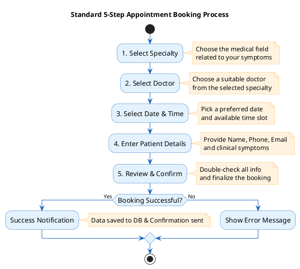

# Workflow Diagram: Appointment Booking (Full 5 Steps)

This is the standard 5-step process used in the MedBooking system, following professional IT workflow standards for presentation.

### The 5 Standard Steps:
1.  **Select Specialty:** Narrow down the search by medical field.
2.  **Select Doctor:** View profiles and choose a professional.
3.  **Select Time:** Interactive slot selection (Real-time check).
4.  **Enter Info:** Provide patient identity and health status.
5.  **Confirm:** The final validation before submission.
