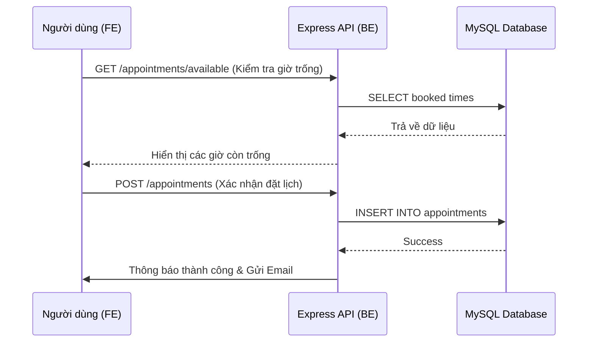

# Giải thích Code Chức năng: Đặt lịch & Chat với Bác sĩ

Tài liệu này giải thích chi tiết cách viết API ở Backend và cách gọi API ở Frontend cho 2 chức năng chính: **Đặt lịch khám (Booking)** và **Chat với Bác sĩ (Real-time Chat)**.

---

## 1. Chức năng Đặt lịch khám (Booking)

### 1.1. Backend (API Creation)
**File chính:** `backend/src/routes/appointments.ts`

Backend sử dụng **Express Router** để định nghĩa các endpoints. Dưới đây là logic chính:

#### A. Tạo lịch hẹn (POST `/`)
*   **Nhận dữ liệu**: Nhận thông tin bệnh nhân, bác sĩ, ngày và giờ khám từ `req.body`.
*   **Lưu Database**: Sử dụng `INSERT INTO appointments` với trạng thái mặc định là `'pending'`.
*   **Gửi Email**: Sau khi lưu thành công, hệ thống tự động gửi email xác nhận cho bệnh nhân thông qua service `email.ts`.

#### B. Kiểm tra giờ trống (GET `/available`)
*   **Tham số**: `doctor_id` và `date`.
*   **Logic**: Tìm các lịch hẹn đã có của bác sĩ đó vào ngày được chọn với trạng thái `pending` hoặc `confirmed`. Trả về danh sách các khung giờ đã bị chiếm.

```typescript
// backend/src/routes/appointments.ts
router.get('/available', async (req, res) => {
    const { doctor_id, date } = req.query;
    const bookedSlots = await query(
        `SELECT appointment_time FROM appointments 
         WHERE doctor_id = ? AND DATE(appointment_date) = ? 
         AND status IN ('pending', 'confirmed')`,
        [doctor_id, date]
        );
    res.json({ bookedTimes: bookedSlots.map(row => row.appointment_time) });
});
```

### 1.2. Frontend (API Consumption)
**Component chính:** `frontend/components/booking-wizard.tsx`

Frontend sử dụng một quy trình 5 bước được quản lý bởi state `bookingData`.

#### Quy trình 5 bước:
1.  **Chọn chuyên khoa (`SpecialtyStep`)**: Lọc danh sách bác sĩ.
2.  **Chọn bác sĩ (`DoctorStep`)**: Chọn bác sĩ cụ thể.
3.  **Chọn thời gian (`TimeStep`)**:
    *   Sử dụng component `Calendar` để chọn ngày.
    *   **Quan trọng**: Mỗi khi chọn ngày, Frontend gọi API `/available` để lấy danh sách giờ đã hết và vô hiệu hóa (`disable`) các nút chọn giờ tương ứng.
4.  **Thông tin bệnh nhân (`PatientInfoStep`)**: Nhập thông tin chi tiết người khám.
5.  **Xác nhận (`ConfirmationStep`)**:
    *   Hiển thị tóm tắt và gọi `api.createAppointment` để gửi dữ liệu lên Backend.

---

## 2. Chức năng Chat với Bác sĩ (Real-time)

Chức năng này kết hợp cả **REST API** (để lấy lịch sử) và **Socket.io** (để nhắn tin tức thời).

### 2.1. Backend (API & Socket)
**File chính:** `backend/src/routes/chat.ts` và logic Socket trong `index.ts`.

*   **API**: Trả về danh sách phòng chat và lịch sử tin nhắn từ database.
*   **Socket**: Lắng nghe sự kiện `send_message`, lưu tin nhắn vào database và phát lại (`emit`) cho người nhận trong cùng phòng.

### 2.2. Frontend (Socket & API)
**Component chính:** `frontend/components/chat/chat-window.tsx`

1.  **Tải lịch sử (REST API)**: Dùng `useEffect` gọi `chatApi.getMessages(roomId)` khi mở cửa sổ chat.
2.  **Nhận tin nhắn mới (Socket)**: Lắng nghe sự kiện socket để cập nhật giao diện ngay lập tức mà không cần tải lại trang.

---

## Tóm tắt Luồng Dữ liệu (Booking)

