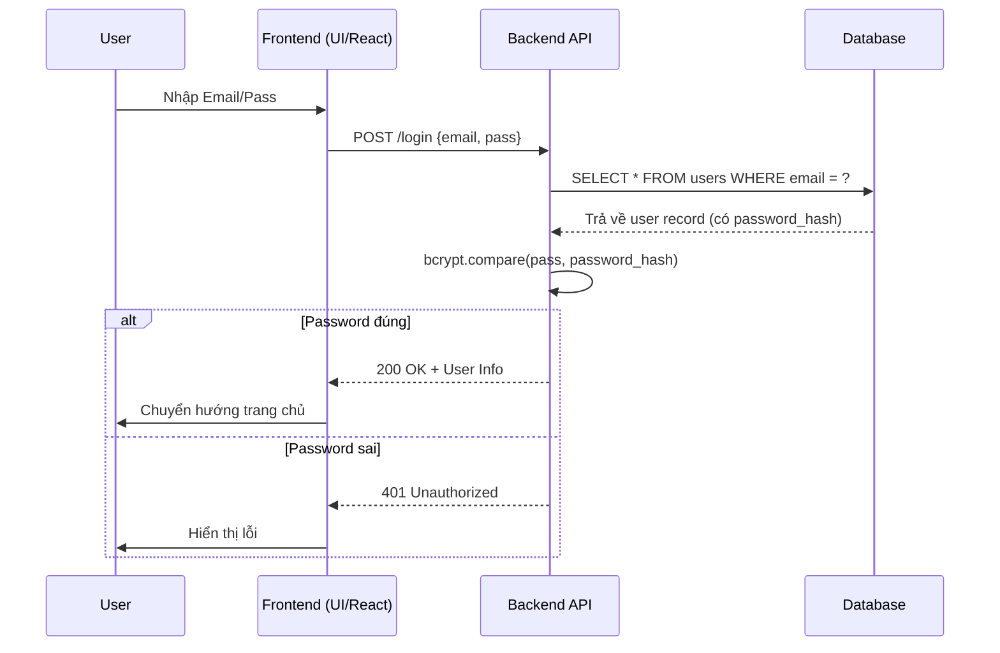
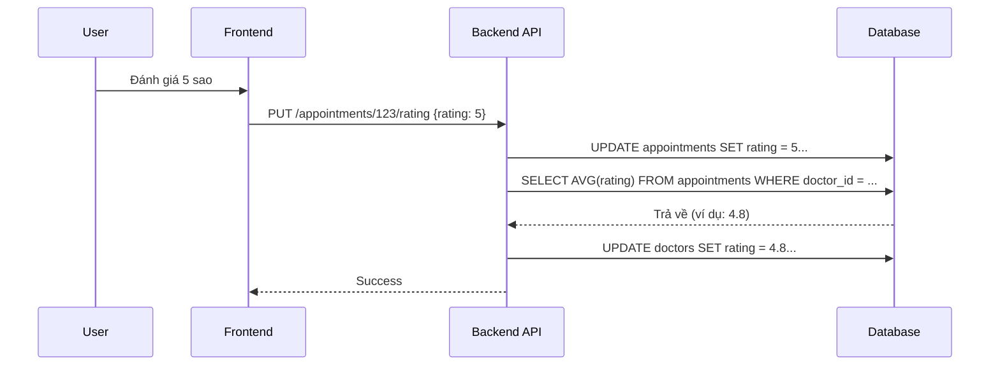

# Luồng Xử Lý Dữ Liệu (Data Flow) - Hệ thống Doctor Care

Tài liệu này mô tả chi tiết luồng đi của dữ liệu qua các tầng: **Frontend (Next.js)** -> **Backend API (Node.js/Express)** -> **Database (MySQL)** cho các chức năng chính của hệ thống.

---

## 1. Phân hệ Tài khoản (Authentication)

### 1.1. Đăng nhập (Login)
*   **Mô tả:** Người dùng nhập email/password để truy cập hệ thống.
*   **Luồng dữ liệu:**
    1.  **FE:** Form `LoginForm` thu thập email, password.
    2.  **API Service:** Gọi `POST /api/login` với body `{email, password}`.
    3.  **BE:** Kiểm tra email tồn tại trong bảng `users` (hoặc `doctor_account`, `admin_users`).
    4.  **BE:** So sánh password hash bằng `bcrypt.compare`.
    5.  **BE:** Nếu đúng, tạo JWT token hoặc session.
    6.  **FE:** Lưu thông tin user vào `localStorage`/Context và chuyển hướng trang.



---

## 2. Phân hệ Đặt lịch khám (Booking Core)

### 2.1. Tìm kiếm & Xem bác sĩ
*   **Mô tả:** Người dùng xem danh sách và lọc theo chuyên khoa.
*   **Luồng dữ liệu:**
    1.  **FE:** User chọn chuyên khoa "Tim mạch".
    2.  **API Service:** Gọi `GET /api/doctors?specialty=Tim mạch`.
    3.  **BE:** Query bảng `doctors` với điều kiện `WHERE specialty = ?`.
    4.  **DB:** Trả về danh sách bác sĩ thỏa mãn.
    5.  **FE:** Render danh sách lên giao diện `DoctorsList`.

### 2.2. Kiểm tra giờ rảnh (Availability Check)
*   **Mô tả:** Khi chọn ngày, hệ thống lọc những giờ đã bị đặt.
*   **Luồng dữ liệu:**
    1.  **FE:** User chọn ngày `2024-01-20`.
    2.  **API Service:** Gọi `GET /api/doctors/:id/unavailable-times?date=2024-01-20`.
    3.  **BE:** Query bảng `appointments` lấy các giờ có status `pending`, `confirmed`, `completed`.
    4.  **DB:** Trả về list `['09:00', '10:30']`.
    5.  **FE:** Disable các nút giờ này trên giao diện.

### 2.3. Đặt lịch mới (Create Appointment)
*   **Mô tả:** User xác nhận đặt lịch.
*   **Luồng dữ liệu:**
    1.  **FE:** Tổng hợp data: User info, Bác sĩ info, Ngày, Giờ, Triệu chứng.
    2.  **API Service:** Gọi `POST /api/appointments`.
    3.  **BE:** Validate dữ liệu, insert vào bảng `appointments` với status `pending`.
    4.  **Backend Service:** Gửi email xác nhận (background task).
    5.  **FE:** Hiển thị thông báo thành công.

```mermaid
sequenceDiagram
    participant User
    participant FE as Frontend
    participant API as Backend API
    participant DB as Database
    participant Email as Email Service

    User->>FE: Chọn Bác sĩ -> Ngày -> Giờ
    FE->>API: GET /unavailable-times
    API->>DB: SELECT time FROM appointments...
    DB-->>FE: List giờ đã kín
    User->>FE: Điền thông tin -> Bấm "Đặt lịch"
    FE->>API: POST /appointments
    API->>DB: INSERT INTO appointments...
    DB-->>API: Success (ID: 123)
    API-)->Email: Gửi email xác nhận
    API-->>FE: 201 Created
    FE->>User: Thông báo thành công
```

---

## 3. Phân hệ Quản lý Lịch hẹn (Dành cho Bệnh nhân & Bác sĩ)

### 3.1. Hủy lịch hẹn
*   **Điều kiện:** Chỉ hủy được khi trạng thái là `pending`.
*   **Luồng dữ liệu:**
    1.  **FE:** User bấm "Hủy".
    2.  **API Service:** Gọi `PUT /api/appointments/:id/cancel`.
    3.  **BE:** Check status hiện tại trong DB.
    4.  **BE:** Nếu `pending` -> Update status = `cancelled`.
    5.  **FE:** Refresh danh sách, status chuyển sang "Đã hủy".

### 3.2. Đánh giá Bác sĩ (Rating)
*   **Mô tả:** Sau khi khám xong (`completed`), user đánh giá sao & nhận xét.
*   **Luồng dữ liệu:**
    1.  **FE:** User chọn 5 sao -> Submit.
    2.  **API Service:** Gọi `PUT /api/appointments/:id/rating`.
    3.  **BE:** Update `rating` vào bảng `appointments`.
    4.  **BE (Auto-calc):** Tính lại trung bình cộng rating của bác sĩ từ tất cả appointment.
    5.  **BE:** Update field `rating` mới vào bảng `doctors`.



---

## 4. Phân hệ Admin (Quản trị)

### 4.1. Thêm Bác sĩ mới
*   **Mô tả:** Admin tạo hồ sơ bác sĩ mới.
*   **Luồng dữ liệu:**
    1.  **FE:** Admin điền form thông tin bác sĩ + upload ảnh.
    2.  **API Service:** Gọi `POST /api/doctors` (Admin route).
    3.  **BE:** Insert vào bảng `doctors`.
    4.  **BE:** Tự động tạo tài khoản tương ứng trong bảng `doctor_account` với pass mặc định.
    5.  **FE:** Cập nhật danh sách bác sĩ.

---

## Tóm tắt Mô hình Dữ liệu

| Chức năng | Method | Endpoint | Bảng tác động chính |
| :--- | :--- | :--- | :--- |
| **Đăng nhập** | POST | `/login` | `users`, `doctor_account`, `admin_users` |
| **Lấy DS Bác sĩ** | GET | `/doctors` | `doctors` |
| **Check Giờ rảnh** | GET | `/.../unavailable-times` | `appointments` |
| **Đặt lịch** | POST | `/appointments` | `appointments` |
| **Hủy lịch** | PUT | `/.../cancel` | `appointments` |
| **Đánh giá** | PUT | `/.../rating` | `appointments`, `doctors` |
